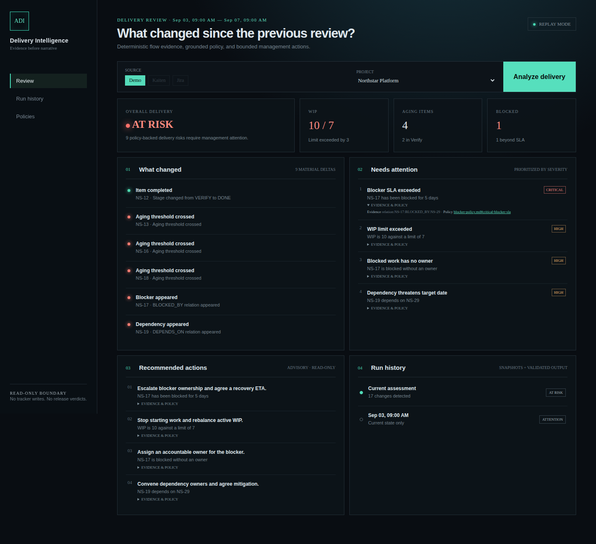
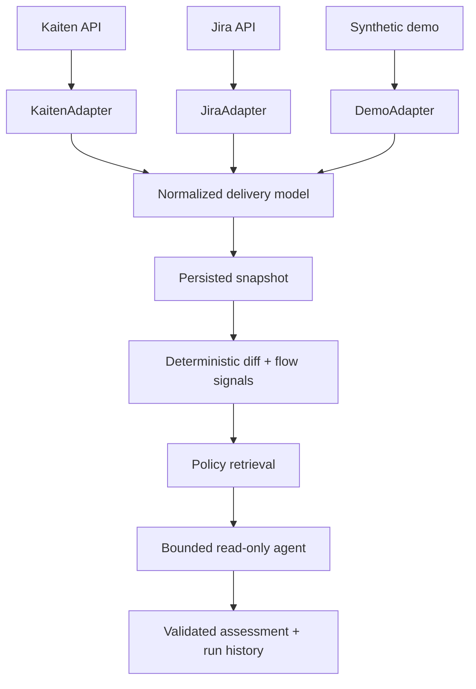

# AI Delivery Intelligence

**Evidence-grounded AI agent for Kanban delivery flow, risks, blockers, dependencies, and management attention.**

[](https://github.com/floppy522/ai-delivery-intelligence/actions/workflows/ci.yml)
[](https://github.com/floppy522/ai-delivery-intelligence/releases)
[](LICENSE)

## At a glance

| | |
|---|---|
| **For** | Technical Project Managers and Delivery Managers |
| **Problem** | Delivery risk emerges gradually across aging work, blockers, dependencies, and changing commitments. |
| **Product** | A read-only agent that compares delivery snapshots, detects flow changes, applies team policies, and recommends management actions with evidence. |
| **Sources** | Kaiten and Jira through one delivery-source adapter model, plus a credential-free demo. |
| **My role** | Problem framing, MVP scope, delivery-domain model, adapter boundaries, agent/tool contracts, RAG decisions, evaluation criteria, acceptance criteria, verification, and release management. |
| **Evidence** | Real read-only adapters, temporal snapshot diff, synthetic demo, CI/E2E, and a versioned 25-case evaluation. |



## What changed since the previous review?

The bundled Northstar story starts with a stable T1 snapshot and then replays T2. The product deterministically identifies WIP growth from 7 to 10, a new blocker beyond SLA without owner or ETA, an aging Verify queue, a dependency threatening the target date, a harmless dependency, a resolved blocker, and completed work. It then separates:

- **facts** computed from normalized snapshots;
- **policy** retrieved from replaceable Markdown sections;
- **AI synthesis** constrained to explanation, prioritization, and management recommendations.

Every risk and action must cite valid evidence and policy IDs. Invalid model output falls back to the validated replay assessment.

## ADI is not release readiness

| AI Delivery Intelligence | [AI Release Intelligence](https://github.com/floppy522/ai-release-intelligence) |
|---|---|
| Continuous delivery health and management attention | A specific release-readiness decision |
| Kanban/work-management state | Engineering and release evidence |
| “A dependency threatens the target date.” | “The release candidate is NOT_READY.” |
| Never issues Go/No-Go | Owns readiness semantics |

No CI, PR coverage, release branches, migrations, back-merges, deployment evidence, scope reconciliation, or release verdicts exist here.

## Sources and capabilities

Capabilities reflect the implemented v0.1.0 adapters, not provider equivalence.

| Capability | Kaiten | Jira Cloud | Demo |
|---|---:|---:|---:|
| Work items / stages | ✓ configurable columns | ✓ configurable statuses | ✓ |
| Due dates / assignees / priority / labels | ✓ | ✓ | ✓ |
| Blockers | ✓ blocker endpoint | Partial: configured issue links/custom timestamps | ✓ |
| Dependencies | Not exposed; never inferred | ✓ configured issue links | ✓ |
| Stage history / entered stage | Not implemented | Partial: configured custom field | ✓ |
| Source URLs | ✓ | ✓ | ✓ |

Kaiten uses the current board/card endpoints and requests blocker details only for cards carrying Kaiten's structured `blocked` flag, as documented by [Kaiten](https://developers.kaiten.ru/). Jira targets Cloud REST v3 and the current enhanced board issue endpoint documented by [Atlassian](https://developer.atlassian.com/cloud/jira/software/rest/api-group-board/). Both adapters are read-only and analyze one board at a time.

## Run it

```bash
docker compose up --build
```

Open `http://localhost:8080`, keep **Demo** selected, and choose **Analyze delivery** for the T1 current-state review. The UI states that no previous snapshot exists. Choose **Advance to T2** to persist the next snapshot and inspect the deterministic changes, `AT_RISK` assessment, evidence, policies, and run history. No tracker credentials or LLM key are required.

- **Replay mode** runs normalization, snapshots, diff, signals, BM25 policy retrieval, validation, persistence, UI, and history without an LLM.
- **Live Agent mode** is enabled by `OPENAI_API_KEY` and uses the [Responses API function-calling loop](https://developers.openai.com/api/docs/guides/function-calling) with strict structured output. Rejected output safely falls back to replay.

Copy `.env.example` to `.env` only for optional integrations. Secrets are never persisted in run history.

## Architecture



See [architecture](docs/architecture.md), [product case](docs/product-case.md), [evaluation](docs/evaluation.md), and [threat model](docs/threat-model.md).

## Verification

```bash
uv run --project apps/api pytest -q
uv run --project apps/api ruff check apps/api/src apps/api/tests evaluation
uv run --project apps/api mypy apps/api/src
uv run --project apps/api python evaluation/run.py
cd apps/web && npm ci && npm test && npm run typecheck && npm run build && npm run e2e
```

The committed v0.1.0 evaluation result is 25/25. Metrics compare runtime output with explicit versioned ground truth for changes and management signals, then measure exact policy matches, evidence references, validator outcomes, cross-adapter facts, and conflicting policy thresholds.

## Scope and limitations

One project/board per run; no Jira–Kaiten aggregation; no write-back, notifications, or automatic escalation; source evidence varies; Jira mappings require configuration; policy quality affects recommendations; throughput is not reported without reliable history; no production-adoption or business-impact claim; public data is synthetic.

`BLOCKED` means deterministic evidence records that delivery has no viable flow path; one blocked item alone does not qualify. v0.1.0 supports this canonical signal but never infers it from prose, so an adapter without that structured evidence reports `AT_RISK` or `ATTENTION` instead. Contradictory machine-readable policy thresholds stop analysis for policy-owner resolution.

Implementation was supported by AI coding agents through specification-driven, test-driven, and review-gated workflows. I remain accountable for scope, product and architecture decisions, trade-offs, acceptance criteria, verification, and release readiness of this project.
