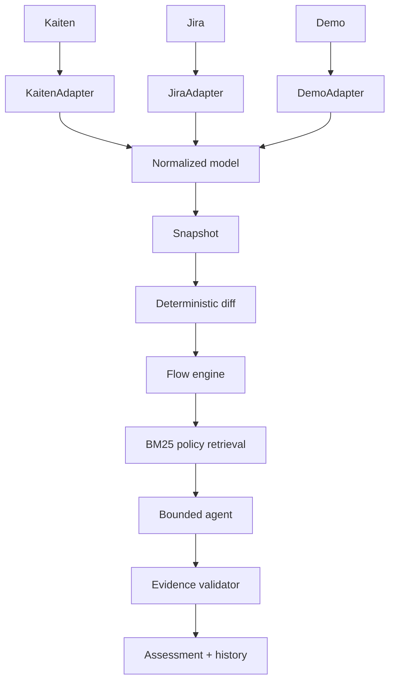
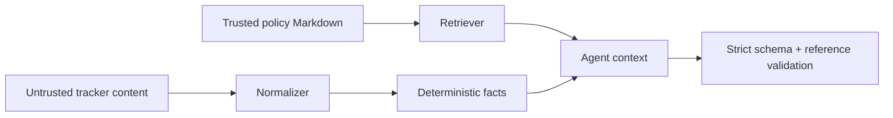

# Architecture

## Processing pipeline

The adapter protocol exposes context listing, collection, capabilities, and a configuration fingerprint. Provider imports are restricted to `adi.adapters`; every downstream layer depends only on canonical models.

## Trust boundaries

Titles, labels, descriptions, and URLs remain data even when they contain instructions. The prompt labels tracker tool output as untrusted; tools cannot perform side effects; the final validator rejects mismatched project/source/period, unsupported changes or signals, incorrect signal-to-policy matches, unknown evidence/entities, status-risk contradictions, actions outside the allowlisted management catalog, missing critical escalations, and release-readiness language.

## Facts, policy, synthesis

| Layer | Example | Authority |
|---|---|---|
| Fact | `NS-17` has been blocked for 5 days and has no owner. | Snapshot + deterministic engine |
| Policy | Critical blockers require an owner, ETA, and escalation within 2 business days. | `blocker-policy.md#critical-blocker-sla` |
| AI synthesis | Escalate ownership and agree a recovery ETA. | Bounded advisory output |

Delivery health is deterministic: `ON_TRACK` has no material policy-backed risk, `ATTENTION` has non-high risks, `AT_RISK` has at least two high/critical risks, and `BLOCKED` requires structured evidence that delivery has no viable flow path. A single blocked work item does not make the whole project `BLOCKED`, and tracker prose can never create that state.

## Persistence

One `delivery_runs` row stores the sanitized source/context identifiers, normalized snapshot, change set, deterministic analysis, validated assessment, and timestamps as JSON. Secrets are held only in process environment and never enter the domain or repository. PostgreSQL is used by Docker Compose; SQLite is the local backend default.

## Failure behavior

- No prior run → current-state-only assessment with explicit uncertainty.
- Unmapped stage → `UNKNOWN`, never an inferred canonical stage.
- Unsupported relation → capability limitation, never LLM inference.
- Empty retrieval → no policy-based claim should be accepted.
- Conflicting `<!-- adi: key=value -->` thresholds → analysis stops for policy-owner resolution.
- Invalid or ungrounded live output → discard and show validated replay output.
- Provider/auth/rate-limit errors → sanitized source error; no secret text.
