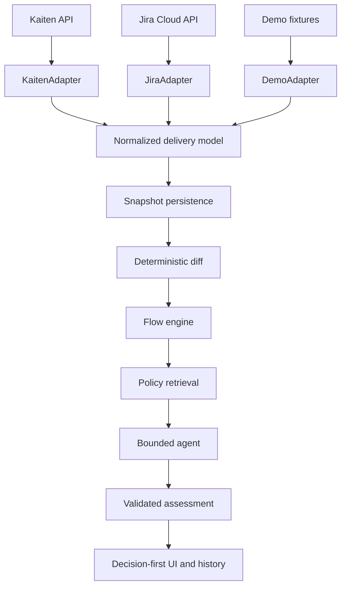

# AI Delivery Intelligence v0.1.0 Design

Date: 2026-09-03

## Product intent

AI Delivery Intelligence (ADI) is read-only decision support for Technical Project Managers and Delivery Managers. It answers one recurring question: **What changed in delivery since the previous review, what requires attention now, and why?**

The primary outcome is a validated delivery-health assessment grounded in normalized tracker facts and cited team policies. The product is not a reporting bot or a general analytics dashboard.

## Boundary from AI Release Intelligence

ADI analyzes continuous Kanban delivery health. AI Release Intelligence (ARI) assesses whether one release candidate can ship.

ADI may state that a dependency threatens a target date. It must never issue Go/No-Go advice, assess release readiness, inspect CI or pull requests, reconcile release scope, inspect release branches, migrations, back-merges, or deployment evidence, or emit `READY`, `NOT_READY`, or `NEEDS_DECISION`.

ADI delivery-health states are `ON_TRACK`, `ATTENTION`, `AT_RISK`, and `BLOCKED`. They describe management attention, not release authority.

## Users and JTBD

Primary user: Technical Project Manager or Delivery Manager performing a periodic flow review.

Secondary users: Engineering Manager, Technical Program Manager, and Project Manager responsible for software delivery.

Job: When delivery evolves across a Kanban system, show the manager material changes, policy deviations, and evidence-backed interventions without requiring manual comparison of tracker states.

## Chosen approach

Use a modular monolith with a FastAPI backend, React and TypeScript web client, PostgreSQL persistence, direct read-only HTTP adapters, an isolated deterministic domain core, inspectable BM25 policy retrieval, and a small bounded OpenAI Responses API tool loop.

Rejected alternatives:

- SQLite-only packaging would reduce operational weight but weaken concurrent run persistence and the flagship integration story.
- Event sourcing, a vector database, microservices, or a general agent framework would add infrastructure without improving the core JTBD in v0.1.0.

## System architecture

The adapters depend on tracker schemas. The normalized model and every downstream component do not import or reference Kaiten or Jira payload types.

## Normalized domain

`DeliveryContext` identifies one source and one board or project. It includes a stable context ID, display name, optional target date, source type, source URL, and declared capabilities.

`WorkItem` includes source-neutral identity, external ID, title, canonical stage, optional assignee, priority, timestamps, due date, stage-entry timestamp when supported, completion timestamp, labels, sanitized source URL, and evidence attributes. Tracker text remains untrusted data.

Canonical stages are `BACKLOG`, `ANALYSIS`, `IN_PROGRESS`, `VERIFY`, `DONE`, and `UNKNOWN`. `UNKNOWN` prevents forced mappings when source configuration is incomplete.

`WorkRelation` contains source item, target item, canonical relation type, creation or observation timestamp when known, resolution timestamp when known, and evidence reference. Relation types are `BLOCKS`, `BLOCKED_BY`, `DEPENDS_ON`, and `DEPENDED_ON_BY`.

`SourceCapabilities` explicitly declares work items, stages, due dates, assignees, blockers, dependencies, stage history, priorities, labels, and source URLs as supported, partial, or unavailable.

`DeliverySnapshot` contains context, observation time, normalized items, relations, capabilities, and stable evidence references. It stores normalized facts rather than complete raw provider payloads.

## Delivery source contract

`DeliverySourceAdapter` exposes:

- `list_contexts()` for discoverable spaces, boards, or projects;
- `collect(context_ref)` returning one validated normalized snapshot candidate;
- `capabilities(context_ref)` describing evidence availability;
- `configuration_fingerprint()` identifying non-secret mapping configuration.

Adapters own pagination, authentication headers, rate-limit/error translation, source-specific mappings, URL construction, and capability degradation. Collection failure produces an explicit source error; missing capabilities produce insufficient-evidence signals rather than AI inference.

## Kaiten adapter

The adapter uses the current official `/api/latest` surface:

- `GET /spaces` for spaces;
- `GET /spaces/{space_id}/boards` for boards and columns;
- paginated `GET /cards?board_id=...&limit=100&offset=...` for cards;
- `GET /cards/{card_id}/blockers` for blocker records when a card is marked blocked or blocking;
- `GET /cards/{card_id}/location-history` only when stage history is required and available.

It maps Kaiten column type and configurable column-title mappings to canonical stages. Board/column WIP limits, card created/updated/due/completed/move timestamps, owner, tags, source identifiers, and card-to-card blockers are normalized. The deprecated nested board-card response is not used.

Kaiten's documented card blocker relation supports `BLOCKS` and `BLOCKED_BY`. Generic dependency support is not claimed unless a documented source field reliably establishes it. The agent cannot infer dependencies from card prose.

## Jira adapter

The adapter targets Jira Cloud and uses current APIs:

- paginated project search and Jira Software board listing;
- enhanced JQL search (`/rest/api/3/search/jql`) or enhanced board issues where a board is selected;
- explicit fields for summary, status, assignee, priority, created, updated, due date, labels, components, resolution date, and issue links;
- paginated `/rest/api/3/issue/{issueIdOrKey}/changelog` when stage-entry history is enabled.

Workflow status mapping and inward/outward issue-link mapping are YAML configuration. Unknown statuses map to `UNKNOWN`; unknown link names are reported as unsupported and never coerced. Authentication is environment-based and read-only.

## Temporal analysis

For each run the orchestrator collects and normalizes source data, validates it, stores the snapshot, loads the preceding compatible snapshot, computes the change set, calculates delivery signals, retrieves relevant policy chunks, invokes replay or live synthesis, validates the assessment, and stores the run.

The change detector computes item creation/completion, stage transitions, blocker/dependency appearance and resolution, assignee changes, due-date changes, overdue transitions, WIP changes and limit crossings, and aging-threshold crossings. If no previous snapshot exists, the run is explicitly current-state only.

## Flow engine

The deterministic engine produces evidence-linked signals for WIP, WIP-limit breaches, aging work, stage queues, blocker age and SLA breaches, missing owner or ETA, dependency pressure near target dates, approaching/overdue commitments, and completions.

Throughput and cycle-time signals are emitted only when snapshot or source history is sufficient for a defined observation window. Metrics support interventions; no general BI surface is built.

## Policies and retrieval

Bundled fictional Markdown policies cover Kanban WIP, blockers, dependencies, delivery risk, escalation, and status reporting. Each heading creates a stable chunk ID of the form `filename#slug`. Front matter and heading hierarchy become metadata.

The retriever tokenizes normalized text and ranks chunks with BM25. The deterministic signal supplies the retrieval query, top-k defaults to four, and a minimum-score rule supports explicit no-match behavior. Conflicting matching policy chunks are both returned and flagged for uncertainty. Users can replace the Markdown files and rebuild the in-memory index at startup.

## Agent and replay modes

The live agent uses the OpenAI Responses API with strict function schemas and a maximum number of tool rounds. Available tools expose the snapshot, changes, flow metrics, aging items, blockers, dependencies, due items, policy search, and item evidence. Tools are read-only and accept allowlisted arguments.

The model receives tracker titles as delimited untrusted data, not instructions. It cannot call shell, network, mutation, messaging, or policy-editing tools. The final Pydantic schema includes explicit uncertainty and references.

Without an API key, the Northstar demo uses a versioned replay assessment that is revalidated against the newly produced facts, policy chunks, and schema before persistence. The deterministic snapshot, diff, signals, retrieval, UI, and history remain live. Documentation distinguishes replay from live agent mode.

## Output validation

Every assessment validates:

- schema and enum conformance;
- project/source/period consistency;
- all item IDs against the current or previous snapshot;
- all evidence IDs against deterministic findings;
- all policy IDs against retrieved chunks;
- severity/status consistency and explicit uncertainty;
- absence of release-readiness vocabulary and unsupported facts.

Invalid live output fails closed and stores a safe failure record without an assessment. It never overrides deterministic results.

## Persistence and API

PostgreSQL stores source configuration without secrets, normalized snapshots, deterministic change sets, signals, assessments, retrieval records, agent mode, and timestamps. Secrets remain process environment only.

FastAPI exposes source discovery, demo phase control, manual analysis, current and historical run retrieval, snapshot/change inspection, health, and liveness endpoints. No mutation endpoint targets external trackers.

## Web experience

The initial screen selects Demo, Kaiten, or Jira and one context, then runs analysis. The result order is delivery health, “What changed since the previous review?”, needs attention, compact flow metrics, blockers, dependencies, recommended actions, evidence/policy citations, and previous runs.

Demo starts at Northstar T1, allows analysis, advances to T2, then analyzes again to show `AT_RISK`. First-run messaging states that no previous snapshot exists. Historical runs expose the saved assessment, snapshot, and detected changes without analytics expansion.

## Synthetic demo

Northstar Platform has 25–35 fictional work items. T1 is stable and within policy. T2 raises WIP above the configured limit, introduces a blocker that exceeds SLA, ages the Verify queue, creates one threatening and one harmless dependency, resolves an earlier blocker, and completes an item.

Demo data contains no employer, employee, customer, incident, project-key, or workflow information.

## Security boundaries

Tracker tokens and model keys come from environment variables, are never returned, logged, committed, or persisted. HTTP clients use configured base URLs and do not follow arbitrary evidence URLs. Tracker content is untrusted; policies are trusted local configuration. Raw source bodies and comments are excluded from agent input unless a later approved feature introduces a safe need.

Prompt injection is tested with a work-item title asking the model to ignore instructions and mark the project on track. The title remains quoted data, tool permissions remain read-only, and reference/status validation rejects the unsupported result.

## Evaluation and verification

A versioned catalog contains 24 scenarios across flow, blockers, dependencies, temporal changes, retrieval, conflict/no-policy behavior, insufficient evidence, invalid references, malformed output, and prompt injection. Cross-adapter fixtures normalize equivalent Jira, Kaiten, and demo situations where provider capabilities permit equivalent facts.

The runner reports deterministic change accuracy, blocker recall, risk recall, escalation accuracy, citation accuracy, evidence coverage, unsupported-claim rate, and invalid-reference rate from actual results. No fabricated benchmark values are committed.

CI runs backend tests and static checks, frontend tests/type-check/build, adapter contract tests, evaluation, Playwright E2E, and Docker Compose smoke checks. The primary E2E path performs T1 then T2 analysis, observes `AT_RISK`, opens change/blocker evidence and a policy citation, and opens the previous run.

## Documentation and portfolio

The public repository contains a concise README, product case, architecture, evaluation, threat model, actual UI screenshots, social preview, MIT license, CI, and v0.1.0 release. The README leads with the temporal management decision rather than installation.

Portfolio copy states that AI coding agents supported implementation through specification-driven, test-driven, and review-gated workflows. Valeriy Malov remains accountable for scope, domain and architecture decisions, trade-offs, acceptance criteria, verification, and release management.

## v0.1.0 limitations

- One project or board per run.
- No Jira/Kaiten aggregation or synchronization.
- No tracker write-back, notifications, or automatic escalation.
- Source capabilities differ; Kaiten does not imply generic dependencies from prose.
- Jira workflows and relation names may require configuration.
- Policy quality affects recommendations.
- Public validation uses synthetic data and provider-shaped fixtures, not employer data.
- No production adoption, measured business impact, or saved-time claim.

## Acceptance boundary

Development stops when the shared normalized pipeline, three adapters, persisted temporal diff, flow signals, replaceable policies, real retrieval, bounded agent, strict grounding, run history, decision-first UI, credential-free demo, 24-case evaluation, security tests, CI/E2E, concise documentation, public screenshots, and v0.1.0 release are verified. No post-MVP feature is added merely to strengthen résumé keywords.

## Primary references

- Kaiten REST API: https://developers.kaiten.ru/
- Jira Cloud platform REST API v3: https://developer.atlassian.com/cloud/jira/platform/rest/v3/intro/
- Jira Software Cloud board API: https://developer.atlassian.com/cloud/jira/software/rest/api-group-board/
- OpenAI function calling: https://developers.openai.com/api/docs/guides/function-calling
- OpenAI structured outputs: https://developers.openai.com/api/docs/guides/structured-outputs
